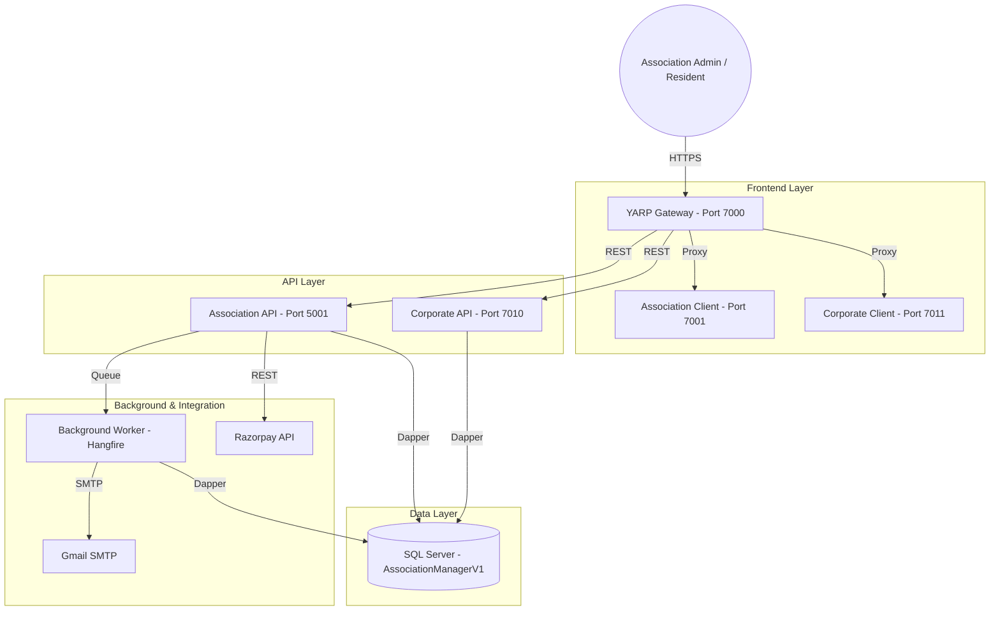
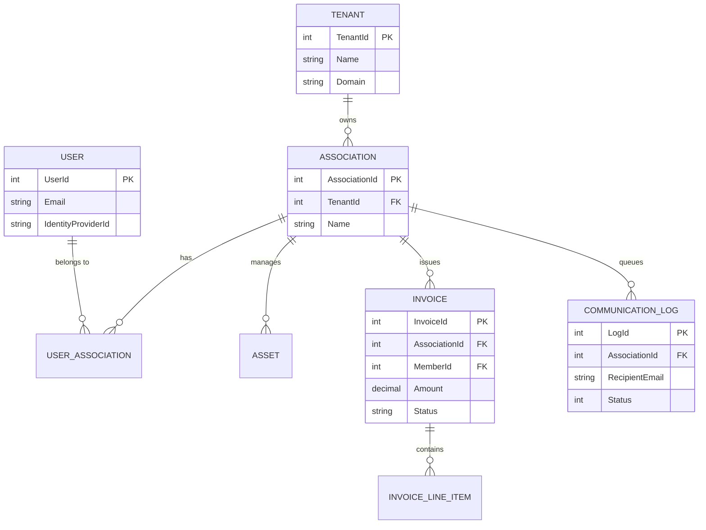
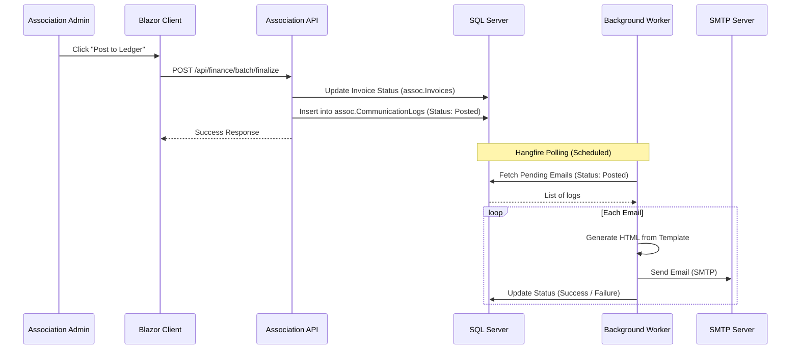
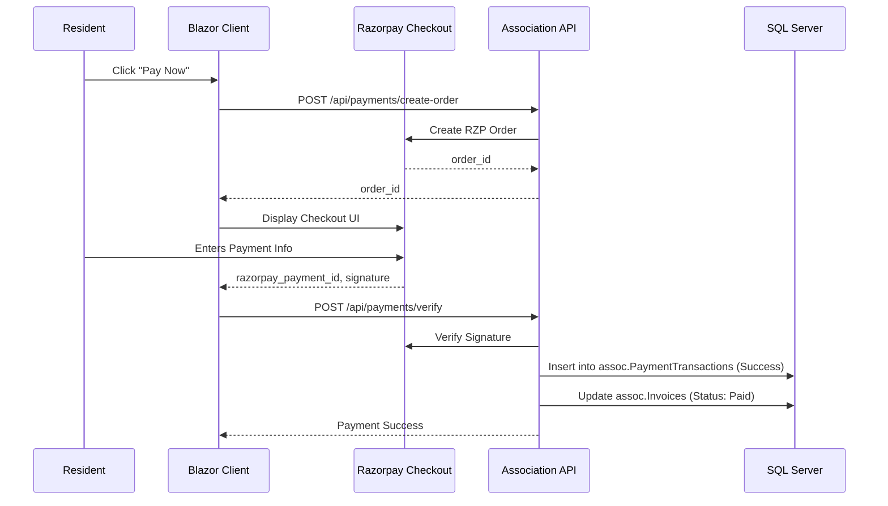
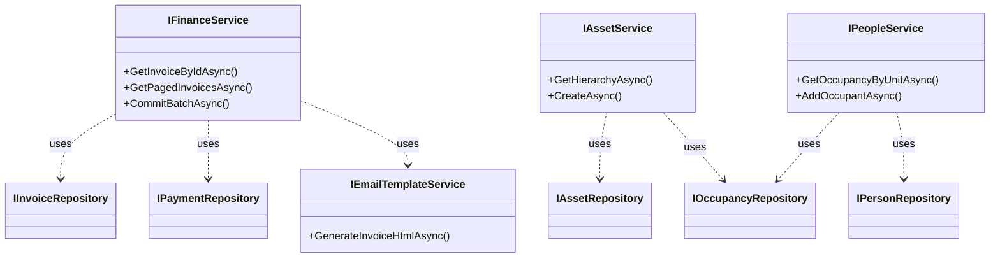
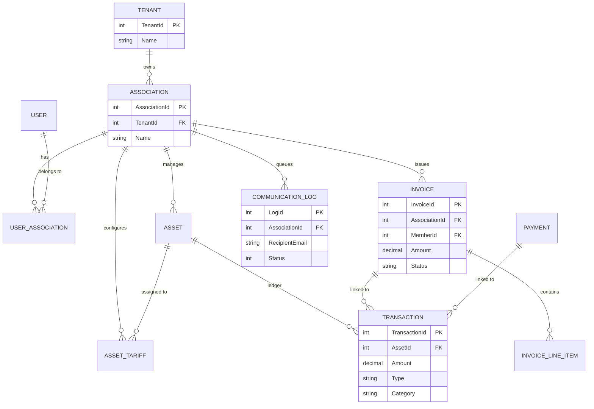

# Association Manager V1 - Architecture Documentation

This document provides a comprehensive overview of the system architecture, component design, data flow, and database schema for the Association Manager application.

## 1. System Overview

Association Manager is a multi-tenant SaaS application designed to manage residential associations, including billing, communication, asset management, and governance.

### High-Level System Diagram

---

## 2. Component Architecture

### 2.1 Web Applications (Blazor WebAssembly)
- **Association Client**: Primary interface for Residents and Association Admins.
- **Corporate Client**: Internal dashboard for Platform Admins to manage tenants and plans.

### 2.2 API Layer (ASP.NET Core)
- **Association API**: Handles association-specific logic (Finance, Assets, Users).
- **Corporate API**: Handles platform-wide management (Tenants, Subscriptions).

### 2.3 Data Access Layer
- **Dapper**: Lightweight ORM for high-performance data access.
- **Repository Pattern**: Abstract data access logic from services.
- **Stored Procedures**: Encapsulates business logic within the database.

---

## 3. Database Schema (Draft ER Diagram)

> [!NOTE]
> This is a high-level representation of the core entities.

---

## 4. Page to API Mapping (Core Features)

## 4. Page to API to DB Mapping Table

This table comprehensive maps each UI page in the Blazor Client to its corresponding API, Service, Repository, and Database interactions.

| Page | API Controller | Core Service | Repository | Stored Procedure or Table |
| :--- | :--- | :--- | :--- | :--- |
| **Finance (Billing)** | `FinanceController` | `FinanceService` | `InvoiceRepository` | `assoc.sp_Invoices_CreateBatch` |
| **Commit Batch** | `FinanceController` | `FinanceService` | `BillingBatchRepository` | `assoc.sp_BillingBatch_UpdateStatus` |
| **Assets** | `AssetController` | `AssetService` | `AssetRepository` | `assoc.sp_Assets_GetByAssociation` |
| **Bulk Asset Create** | `AssetController` | `AssetService` | `AssetRepository` | `assoc.sp_Assets_Create` |
| **Users** | `UserController` | `AssocUserService` | `AssocUserRepository` | `assoc.sp_Users_GetByAssociationId` |
| **People/Occupancy** | `PeopleController` | `PeopleService` | `OccupancyRepository` | `assoc.sp_Occupancy_GetByAssetId` |
| **Email Queue** | `CommunicationController` | `EmailDispatchJob` | `CommunicationRepository` | `assoc.sp_CommunicationLogs_GetByAssociation` |
| **Payments** | `PaymentsController` | `PaymentServiceV2` | `PaymentRepository` | `assoc.sp_Transactions_Create` |
| **Razorpay Verify** | `PaymentsController` | `PaymentServiceV2` | `RazorpayRepository` | `assoc.sp_PaymentTransactions_Update` |
| **Dashboard** | `DashboardController` | `DashboardService` | `DashboardRepository` | `assoc.sp_Dashboard_GetStats` |
| **Settings** | `AssociationController` | `AssociationService` | `AssociationRepository` | `corp.sp_Associations_Update` |
| **Fine Settings** | `FinanceController` | `FineService` | `FineRepository` | `assoc.sp_FineSettings_Upsert` |
| **Maintenance** | `OperationsController` | `OperationsService` | `WorkOrderRepository` | `assoc.sp_WorkOrders_GetAll` |
| **My Wallet** | `FinanceController` | `FinanceService` | `PaymentRepository` | `assoc.sp_Transactions_GetBalance` |

---

## 5. Detailed Sequence Diagrams

### 5.1 Billing Batch Finalization & Email Dispatch
This diagram illustrates the flow when a billing batch is finalized and emails are dispatched.

### 5.2 Payment Verification (Razorpay)
This diagram illustrates the flow when a resident makes a payment via Razorpay.

---

## 6. Class Hierachy (Core Services)

---

## 7. Database Detail (ER Diagram)

This ER diagram illustrates the core entity relationships based on the SQL project schema.

