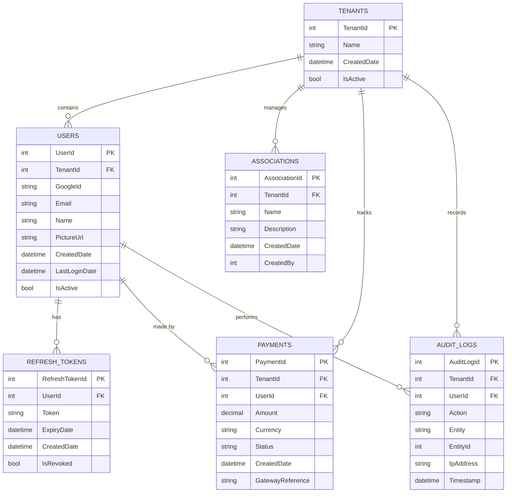

# Entity Relationship Diagram (ERD) - AssociationManagerSaaS

```mermaid
erDiagram
    TENANTS ||--o{ USERS : "contains"
    TENANTS ||--o{ ASSOCIATIONS : "manages"
    TENANTS ||--o{ PAYMENTS : "tracks"
    TENANTS ||--o{ AUDIT_LOGS : "records"
    USERS ||--o{ REFRESH_TOKENS : "has"
    USERS ||--o{ PAYMENTS : "made by"
    USERS ||--o{ AUDIT_LOGS : "performs"

    TENANTS {
        int TenantId PK
        string Name
        datetime CreatedDate
        bool IsActive
    }

    USERS {
        int UserId PK
        int TenantId FK
        string GoogleId
        string Email
        string Name
        string PictureUrl
        datetime CreatedDate
        datetime LastLoginDate
        bool IsActive
    }

    REFRESH_TOKENS {
        int RefreshTokenId PK
        int UserId FK
        string Token
        datetime ExpiryDate
        datetime CreatedDate
        bool IsRevoked
    }

    ASSOCIATIONS {
        int AssociationId PK
        int TenantId FK
        string Name
        string Description
        datetime CreatedDate
        int CreatedBy
    }

    PAYMENTS {
        int PaymentId PK
        int TenantId FK
        int UserId FK
        decimal Amount
        string Currency
        string Status
        datetime CreatedDate
        string GatewayReference
    }

    AUDIT_LOGS {
        int AuditLogId PK
        int TenantId FK
        int UserId FK
        string Action
        string Entity
        int EntityId
        string IpAddress
        datetime Timestamp
    }
```
