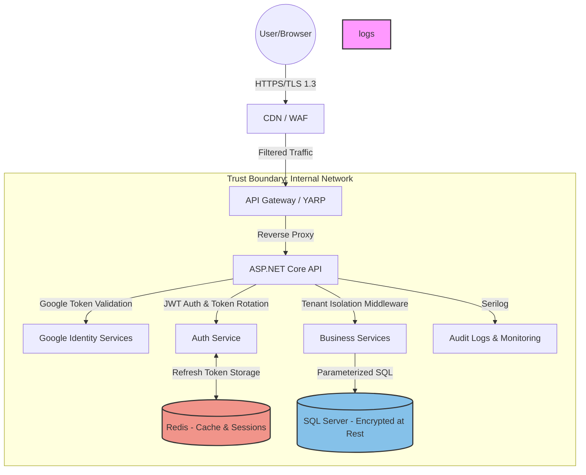

# Security Diagram - AssociationManagerSaaS

## Security Features
1. **JWT Authentication**: Short-lived access tokens (15m).
2. **Token Rotation**: Refresh tokens expire and rotate on every use.
3. **Multi-tenancy**: Hardcoded `TenantId` discriminator in all SQL queries via Dapper.
4. **Data Protection**: Secrets managed via environment variables/Key Vault (recommended for production).
5. **Real-time Security**: SignalR hubs protected with JWT authorization.
6. **Background Security**: Hangfire jobs run with service account permissions.
