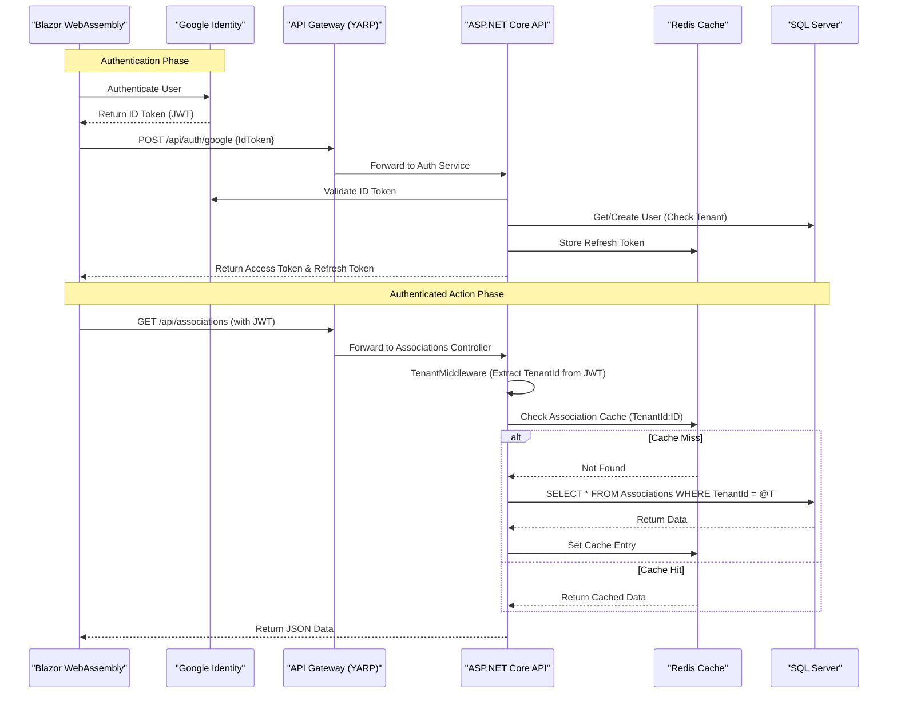

# Sequence Diagram: Google Login and Action Flow

```mermaid
sequenceDiagram
    participant Browser as "Blazor WebAssembly"
    participant Google as "Google Identity"
    participant Gateway as "API Gateway (YARP)"
    participant Api as "ASP.NET Core API"
    participant Redis as "Redis Cache"
    participant DB as "SQL Server"

    Note over Browser, Google: Authentication Phase
    Browser->>Google: Authenticate User
    Google-->>Browser: Return ID Token (JWT)
    Browser->>Gateway: POST /api/auth/google {IdToken}
    Gateway->>Api: Forward to Auth Service
    Api->>Google: Validate ID Token
    Api->>DB: Get/Create User (Check Tenant)
    Api->>Redis: Store Refresh Token
    Api-->>Browser: Return Access Token & Refresh Token

    Note over Browser, DB: Authenticated Action Phase
    Browser->>Gateway: GET /api/associations (with JWT)
    Gateway->>Api: Forward to Associations Controller
    Api->>Api: TenantMiddleware (Extract TenantId from JWT)
    Api->>Redis: Check Association Cache (TenantId:ID)
    alt Cache Miss
        Redis-->>Api: Not Found
        Api->>DB: SELECT * FROM Associations WHERE TenantId = @T
        DB-->>Api: Return Data
        Api->>Redis: Set Cache Entry
    else Cache Hit
        Redis-->>Api: Return Cached Data
    end
    Api-->>Browser: Return JSON Data
```
