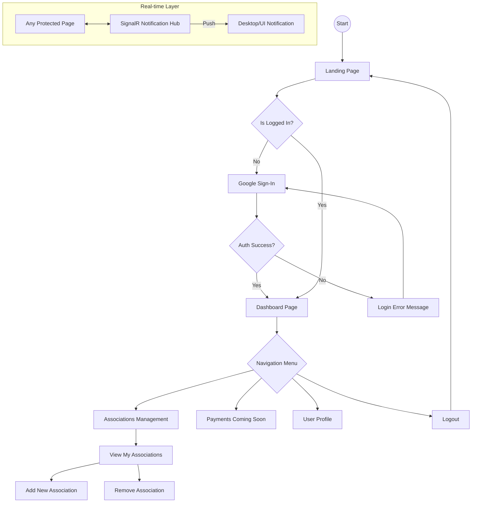

# User Flow Diagram - AssociationManagerSaaS

```mermaid
graph TD
    Start((Start)) --> Landing[Landing Page]
    Landing --> Login{Is Logged In?}
    Login -- No --> GoogleAuth[Google Sign-In]
    GoogleAuth --> Success{Auth Success?}
    Success -- Yes --> Dashboard[Dashboard Page]
    Success -- No --> LoginError[Login Error Message]
    LoginError --> GoogleAuth
    Login -- Yes --> Dashboard
    
    Dashboard --> Nav{Navigation Menu}
    Nav --> Assoc[Associations Management]
    Nav --> Pay[Payments Coming Soon]
    Nav --> Profile[User Profile]
    Nav --> Logout[Logout]
    
    Assoc --> List[View My Associations]
    List --> Create[Add New Association]
    List --> Delete[Remove Association]
    
    Logout --> Landing
    
    subgraph "Real-time Layer"
        AnyPage[Any Protected Page] <--> Hub[SignalR Notification Hub]
        Hub -->|Push| UserNotify[Desktop/UI Notification]
    end
```
