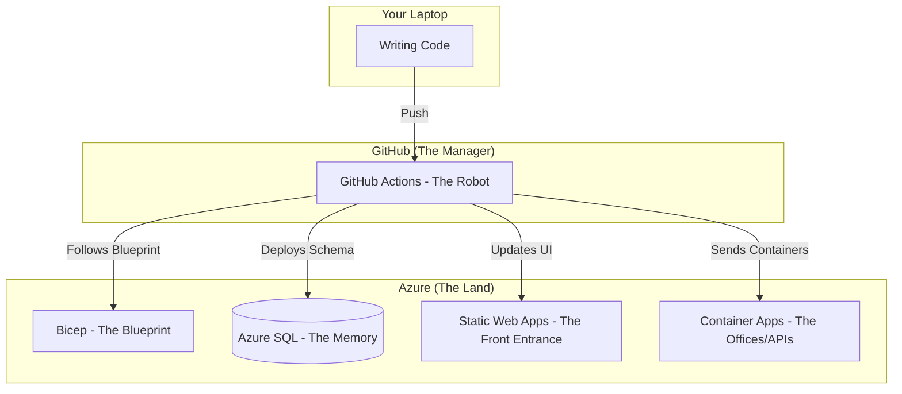

# 🚀 Beginner's Guide to Azure Deployment

If you are new to the team, welcome! This guide explains how we move our code from your laptop to the "Cloud" (Azure) so that users can access it from anywhere in the world.

---

## 1. The Big Picture (How it all works)

Think of our platform like a **Modern Shopping Mall**:

---

## 2. What do these words mean? (The Glossary)

If you hear these technical terms, here is what they actually mean:

| Word | Real-World Meaning | What it does for us |
| :--- | :--- | :--- |
| **Bicep** | The Blueprint | A file that tells Azure: "Build me a Database and a Server." |
| **Docker** | The Shipping Container | Packs our API into a box so it runs exactly the same in Azure as it does on your laptop. |
| **GitHub Actions** | The Robot | An automated worker that sees your code, builds it, and puts it in Azure for you. |
| **Resource Group** | A Folder | A big folder in Azure that holds everything for the project so we don't lose it. |
| **Environment Variable** | A Sticker | A label we put on a container to tell it: "The Database is at this address." |

---

## 3. The 3 Steps to Success

### Step 1: Tell Azure what to build (Infrastructure)
We don't go into the Azure Portal and click 100 buttons. Instead, we use a file in `Deployment/Azure/infra`. 
- **What happens?** The "Robot" (GitHub Actions) reads this file and builds the Database, the Key Vault (our safe), and the Servers.

### Step 2: Prepare the Memory (Database)
The cloud database starts empty. We need to create the tables.
- **What happens?** The Robot runs a special project called `AssociationManager.Database`. It creates all the tables and adds the "Starter Users" so you can log in.

### Step 3: Send the Code (Deployment)
Now we send the containers.
- **What happens?** The Robot "packages" the Gateway and the APIs into Docker containers and sends them to Azure. It also sends the Blazor website (the UI) to a special place called "Static Web Apps."

---

## 4. Your Checklist for the First Deployment 📝

If you are assigned to set up a new environment (like "Test" or "QA"), follow this list:

1. **Get the Key**: You need a special "Access Key" from the Lead Developer to put into GitHub (the `AZURE_CREDENTIALS`).
2. **Firewall**: Azure is very safe. You must tell the Database: "It's okay to let my laptop talk to you." (Found in SQL Server > Networking).
3. **Secrets**: Put your Google ClientID and Database password into the **Azure Key Vault**. This is our company safe.
4. **The "Green Light"**: Go to the GitHub "Actions" tab. If you see a Green Checkmark ✅, it means your code is live!

---

## 5. Frequently Asked Questions (FAQ)

**Q: I pushed code, but the website didn't change!**
*A: Check the GitHub Actions tab. The "Robot" might still be building the containers. It usually takes 3-5 minutes.*

**Q: The website says "502 Bad Gateway"!**
*A: This usually means the API is still waking up. Wait 30 seconds and refresh. If it stays, the API might be missing a "Sticker" (Environment Variable).*

**Q: Where is my data?**
*A: Check the `corp.Associations` table in the Azure Portal's Query Editor. If it's empty, you might need to run the Database Migration again.*

---
*Welcome to the Cloud!* 🛡️🚀🌐
