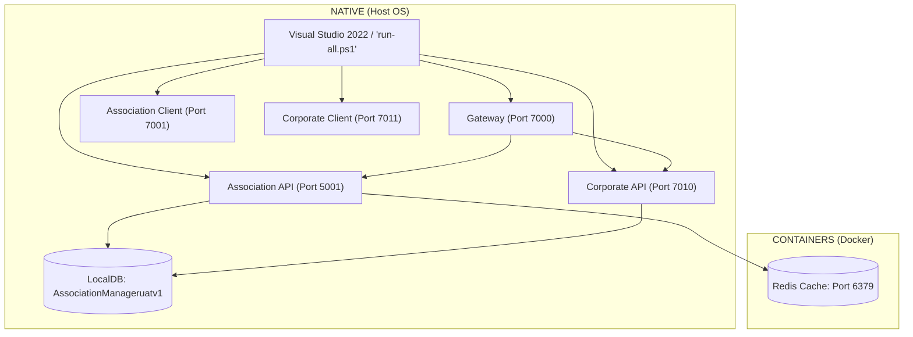

# 💻 Native Local Execution Guide: AssociationManagerSaaS

This guide walks you through running the entire **AssociationManagerSaaS** application natively on your local Windows machine. 

To keep the setup **highly simple and fast**, we separate our external container dependency (Redis) from our core .NET services which run natively on the host OS.

## 🏗️ Architectural Setup



---

## 🛠️ Step 1: Spin Up Redis (Separate Container Process)

The .NET services use Redis for caching. We keep the container process completely isolated.

Run this simple command in your terminal to start a Redis container in the background:

```powershell
docker run -d --name redis-local -p 6379:6379 redis:alpine
```
> [!NOTE]
> If you already have Redis running locally (e.g., via Memurai or a native Windows installation), you can skip this step!

---

## ⚙️ Step 2: Establish HTTPS Trust Certificates

Before running the APIs locally over secure HTTPS, ensure your local dev-certs are trusted:

```powershell
dotnet dev-certs https --trust
```

---

## 🔒 Step 3: Configure Local Application Settings

1. Open [localappsettings.json](file:///c:/Users/Baska/source/repos/baskarkannappan/AssociationManagerV1_dev/localappsettings.json) in the workspace root and verify your database and Redis server addresses.
2. Run the settings script to distribute these configuration values to all relevant projects:
   ```powershell
   ./apply-local-settings.ps1
   ```

> [!TIP]
> This script automatically updates `appsettings.Development.json` for APIs, `local.settings.json` for Functions, and the database migration project!

---

## 🗄️ Step 4: Database Schema and Seed Data

For local database setup, you have two options depending on your preference:

### Option A: Via Command Line (Fastest)
Run the migration database project directly:
```powershell
dotnet run --project AssociationManager.Database\AssociationManager.Database.csproj
```
This automatically deploys all DB migrations using DbUp.

### Option B: Via Visual Studio (Authoritative Schema)
1. Open the solution `AssociationManagerSaaS.slnx` in Visual Studio.
2. Right-click the **`AssociationManager.DBSchemas`** project and choose **Publish**.
3. Select your local database `(localdb)\mssqllocaldb` and DB `AssociationManageruatv1`.
4. Once published, run the [Seed_Data.sql](file:///c:/Users/Baska/source/repos/baskarkannappan/AssociationManagerV1_dev/Seed_Data.sql) file inside your database instance to initialize lookup values and test data.

---

## 🚀 Step 5: Launch the Application Suite

You can run the full suite using **PowerShell** or **Visual Studio 2022**:

### Option A: The One-Click Launch Script (PowerShell)
Run the launch script from the root of the workspace:
```powershell
./run-all.ps1
```
This will:
- Stop any stale processes.
- Cleanly rebuild the gateway, APIs, and clients.
- Verify migrations and check financial integrity.
- Spin up each of the 5 services in a separate, minimized PowerShell window.

### Option B: Visual Studio 2022
1. Open `AssociationManagerSaaS.slnx` in Visual Studio 2022.
2. Right-click the solution, choose **Configure Startup Projects...**
3. Select **Multiple Startup Projects** and set **Start** action for:
   - `AssociationManager.Gateway`
   - `AssociationManager.Api`
   - `AssociationManager.Corporate.Api`
   - `AssociationManager.Client`
   - `AssociationManager.Corporate.Client`
4. Press `F5` or `Ctrl + F5` to run all services simultaneously.

---

## 🌐 Local Endpoint Routing

Once the application is up, use the following local URLs:

| Service | Protocol / Address | Description |
| :--- | :--- | :--- |
| **Gateway** | [https://localhost:7000](https://localhost:7000) | Public reverse-proxy endpoint |
| **Association Client (Blazor)** | [https://localhost:7001](https://localhost:7001) | User & HOA Management UI |
| **Corporate Client (Blazor)** | [https://localhost:7011](https://localhost:7011) | Corporate & Platform Admin UI |
| **Association API Swagger** | [https://localhost:5001/swagger](https://localhost:5001/swagger) | Core business backend endpoints |
| **Corporate API Swagger** | [https://localhost:7010/swagger](https://localhost:7010/swagger) | Platform/Corporate backend endpoints |
